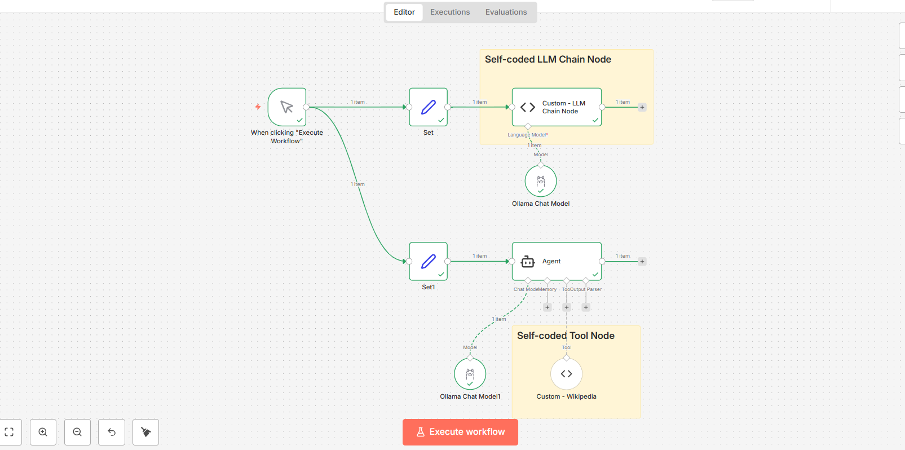
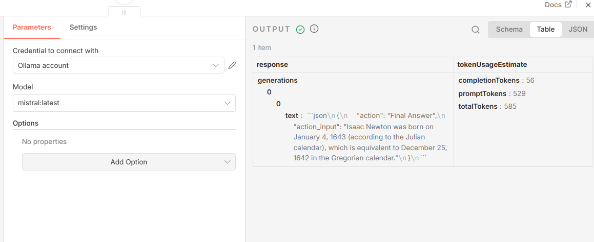

# 🤖 AI Agent with Wikipedia Tool using n8n + Ollama (LangChain)

An AI-powered autonomous agent built using **n8n**, **LangChain Code Nodes**, and **Ollama (Mistral model)**.  
The agent can answer natural language questions and dynamically use a custom-built Wikipedia tool.

This project demonstrates real-world AI workflow automation using local LLM deployment via Docker.

---

## 🚀 Tech Stack

- **n8n** – Workflow Automation Platform  
- **LangChain** – AI orchestration framework  
- **Ollama** – Local LLM runtime  
- **Mistral Model** – Open-source LLM  
- **Docker & Docker Compose** – Containerized deployment  
- **JavaScript (Code Nodes)** – Custom LLM chain + tool logic  

---

## 🧠 Project Architecture

The workflow consists of:

1. Manual Trigger
2. Set Node (User Input)
3. Custom LLM Chain Node
4. Ollama Chat Model (mistral:latest)
5. LangChain Agent
6. Custom Wikipedia Tool Node

The agent:
- Receives a user question
- Decides whether to use a tool
- Calls the custom Wikipedia tool
- Returns a structured final answer

---

## 📸 Workflow Overview



---

## 📸 Model Output (Ollama - Mistral)



---

## ⚙️ How to Run Locally

### 1️⃣ Install Requirements

- Docker Desktop
- Ollama
- n8n

---

### 2️⃣ Pull LLM Model

```bash
ollama pull mistral
```

---

### 3️⃣ Start Ollama

```bash
ollama serve
```

---

### 4️⃣ Start n8n via Docker

```bash
docker compose up -d
```

---

### 5️⃣ Import Workflow

- Open http://localhost:5678
- Import `workflow.json`
- Execute workflow

---

## 📂 Project Structure

```
ai-agent-wikipedia-n8n/
│
├── workflow.json
├── docker-compose.yml
├── README.md
└── screenshots/
    ├── workflow.png
    └── ollama-mistral-model-output.png
```

---

## 🎯 Key Features

- Local LLM execution (no OpenAI API required)
- Custom LangChain LLM Chain Node
- Custom Tool Integration
- Autonomous AI Agent decision-making
- Dockerized deployment
- Modular architecture

---

## 💡 Example Query

```
What year was Isaac Newton born?
```

### Example Output

```
Isaac Newton was born on January 4, 1643 (Gregorian calendar).
```

---

## 🔥 Why This Project Matters

This project demonstrates:

- AI workflow automation
- Agent-based reasoning systems
- Tool-augmented LLM architecture
- Production-style local deployment
- LangChain integration inside n8n

It reflects practical AI system design beyond simple API calls.

---

## 📌 Future Enhancements

- Add PDF ingestion tool
- Add Resume–JD matching capability
- Add memory persistence
- Deploy to cloud (AWS / GCP)
- Add vector database (FAISS / Chroma)

---

## 👩‍💻 Author

**Hardhika Matta**  
AI & ML | Automation | LLM Systems | AI Product Management

---

⭐ If you found this interesting, feel free to star the repository!
